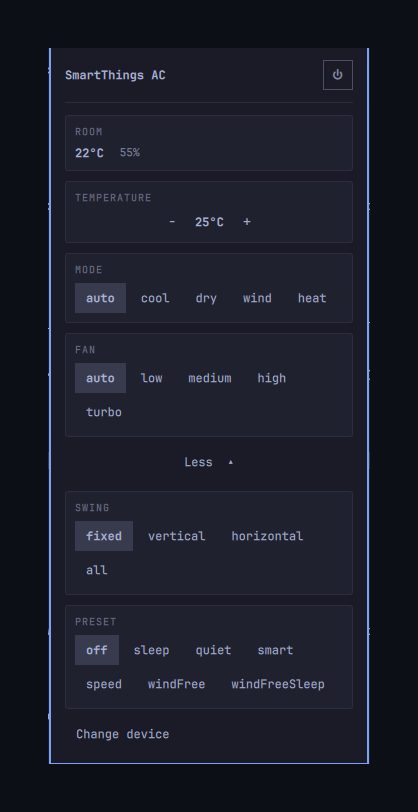

# SmartThings AC

<p align="center">
  
</p>

Control an air conditioner from the Omarchy bar: power, target temperature,
mode, fan speed, swing and presets. The bar shows the room temperature whether
or not the unit is running, and the panel adds humidity and a feels-like figure.

Built against a Samsung WindFree, but nothing in it is Samsung-specific. Every
control is built from the capability list the device itself publishes, so a
unit offering different modes shows different buttons with no code change, and
the temperature range comes from the device rather than a constant.

## What it does not do

Scheduling, and more than one unit at a time. Both are possible; neither is
here yet.

Air quality is deliberately absent. The capability exists on the unit this was
built against, but both of its dust sensors report null, so there would be
nothing to show.

There is no local control. Newer Samsung units answer only through Samsung's
cloud — the local protocol older models spoke on port 2878 is gone — so this
plugin talks to SmartThings and needs the internet to do anything.

## Requirements

- Omarchy 4 (Quattro)
- `curl` and `jq` — present on a default install
- Node, for the SmartThings CLI: `npm install -g @smartthings/cli`

## Install

```bash
omarchy plugin add https://github.com/artur-hash/omarchy-smartac.git --enable
```

## Setup

```bash
~/.config/omarchy/plugins/io.github.artur-hash.smartac/scripts/setup.sh
```

It checks for node, installs the SmartThings CLI **after asking**, opens a
browser to log in, and finishes by running this plugin's own `doctor` so you
know it worked before you go looking at the bar. then pick your air conditioner in the panel.

Omarchy never executes plugin code at install time, which is the right call, so
nothing here runs on its own — you run this once.

By hand, if you prefer:

```bash
npm install -g @smartthings/cli
smartthings locations
```

The panel also has a **Log in** button once the CLI is installed, which does the
same thing as that second command.

Install the CLI **globally**, not through `npx`. This plugin stores no
credential of its own and never touches the keyring — it reads the session the
CLI keeps, the way other tools read `gcloud`'s or `gh`'s, and that session
renews itself. But the CLI only renews it when one of its own commands runs, so
without `smartthings` on `PATH` the session works for a day and then dies. The
panel and `doctor` both say so rather than leaving you to guess.

### Why there is no token to paste

SmartThings expires a personal access token **24 hours after it is created**.
Tokens issued before 30 December 2024 could last fifty years; new ones cannot.
A bar widget that asks for a fresh credential every morning is not one anybody
keeps, so that path was removed rather than kept as a fallback nobody should
choose.

The remaining route — registering an OAuth app — is closed to anyone whose home
was set up by someone else and shared with them: authorising an app means
installing it into a location you own, and a shared member owns none. Their
devices read and control perfectly; only app authorisation is refused. The CLI
sidesteps it because its own client installs with no location.

## When a setting does not take

Some units silently ignore a command that does not apply to their current
state. The cloud still answers `COMPLETED` — the device simply drops it. The
panel reads the state back a few seconds after every write and says so when
the value did not change, rather than showing a button that quietly springs
back.

Observed on a Samsung AR12BSEAAWKNAZ:

- **WindFree only engages in `cool`.** In `auto` or `heat` the preset is
  accepted and discarded.
- **The setpoint cannot be changed while the unit is off.**
- **Each mode keeps its own setpoint**, so the temperature shown changes on its
  own when the mode does. That is the device remembering, not a misread.
- **Choosing a mode turns the unit on.** Sending a mode to a unit that is off
  powers it up rather than storing the setting for later.

The cloud reflects a change about three seconds after the command returns --
measured on this unit, absent at 1.4s and present by 3.2s -- so the panel
confirms in roughly that time rather than the instant the write succeeds.

None of these rules are hardcoded. Other hardware has other constraints, and a
list written here would go stale the first time a firmware update moved one.

## What the backend trusts

Nothing the network says, beyond its shape.

`omarchy-shell` is one long-lived process shared by every widget, and the QML
side collects this helper's whole stdout. A response with no ceiling on it is
therefore a way for whatever answers on the other end of the socket to exhaust
the shell, not just this plugin. So the ceiling is enforced while the response
is arriving rather than after it has been read: `head` closes the pipe once it
has taken its fill and curl dies of SIGPIPE, and an overflow fails closed —
a truncated body is never parsed, guessed at, or passed on.

Past that, every value forwarded to the panel is clamped: strings to 128
characters, supported-value lists to 64 entries, the device picker to 200 rows.
A real payload is orders of magnitude under all of these. They exist so the
cost of a hostile or broken response stays bounded, not to be tight.

## Diagnostics

```bash
bin/smartac doctor
bin/smartac doctor --capabilities --device <id>
```

The second prints the raw capability list your device reports, which is the
quickest way to find out why a control is missing.

## Removal

```bash
omarchy plugin remove io.github.artur-hash.smartac
```

Nothing is left behind but the keyring entry, which `token clear` removes.
There is no systemd unit and no file outside the plugin directory.

## License

MIT.
